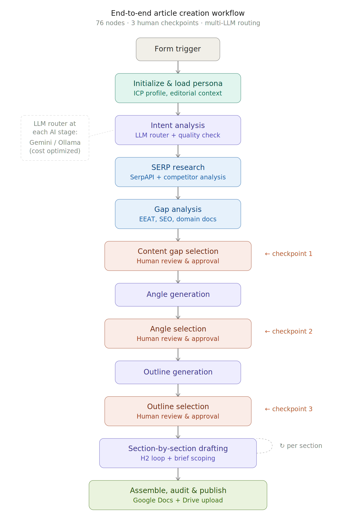
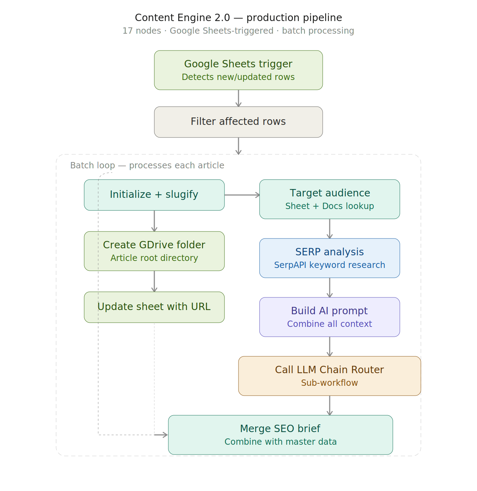
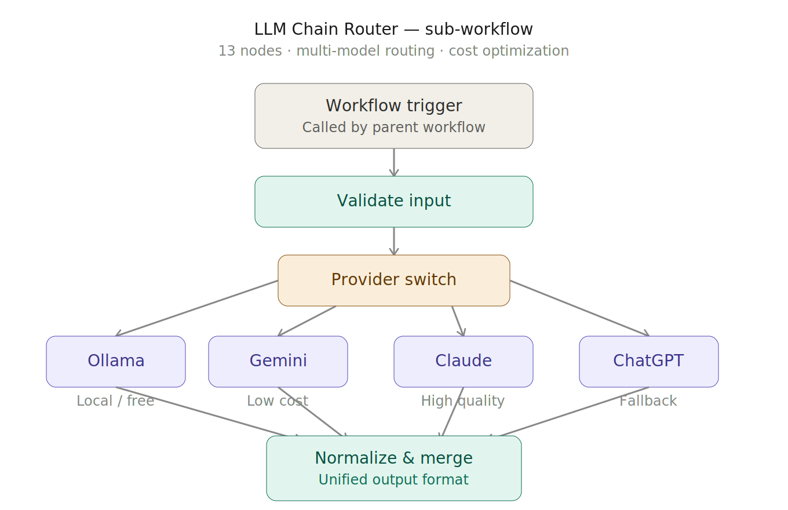

# n8n Content Automation Workflows

Production-ready content automation systems built on self-hosted n8n. These workflows automate end-to-end article creation, SEO brief generation, and multi-LLM routing with structured human-in-the-loop checkpoints.

Built to solve a real problem: scaling high-quality content production without sacrificing editorial control.

## Workflows

### 1. Complete Content Generation Workflow

**76 nodes · 3 human checkpoints · multi-LLM routing**

An end-to-end article creation pipeline that takes a topic input and produces a fully drafted, audited article published to Google Docs — with human review gates at every critical decision point.

**What it does:**

- Accepts topic input via form trigger and loads ICP persona and editorial context
- Runs intent analysis through LLM router with quality validation
- Performs SERP research via SerpAPI and analyzes competitor content
- Loads domain knowledge docs (EEAT standards, SEO strategy, editorial voice guide) and runs gap analysis
- **Checkpoint 1:** Surfaces content gaps for human selection before proceeding
- Generates multiple content angles using selected gaps + domain context
- **Checkpoint 2:** Presents angle options for human approval
- Generates outline options based on approved angle
- **Checkpoint 3:** Human selects and approves final outline
- Drafts article section-by-section (H2 loop), scoping each section with brief context before drafting
- Assembles final article, runs editorial audit, and publishes to Google Docs with HTML formatting
- Uploads final document to Google Drive

**Key design decisions:**

- Human-in-the-loop at gap selection, angle selection, and outline approval — not just at the end. This prevents the system from drafting 3000 words in the wrong direction.
- LLM router at every AI stage allows switching between Gemini and Ollama based on task complexity and cost.
- Section-by-section drafting with accumulated context prevents drift and maintains coherence across long articles.
- Knowledge docs (persona, EEAT standards, SEO strategy, domain knowledge, editorial voice) are loaded from disk and injected into prompts — not hardcoded. Swap the docs, change the output.

---

### 2. Content Engine 2.0 (In Progress)

**17 nodes · Google Sheets-triggered · batch processing**

A production pipeline that monitors a Google Sheet for new keywords, automatically generates SEO briefs, and sets up the folder structure for each article — designed to run continuously with minimal intervention.

**What it does:**

- Triggers on new or updated rows in a Google Sheet (the editorial calendar)
- Filters for actionable rows and processes each article in a batch loop
- For each article: generates a URL slug, creates a Google Drive folder, and updates the sheet with the folder URL
- In parallel: looks up target audience definitions from a separate sheet and loads the corresponding audience document from Google Docs
- Runs SERP analysis via SerpAPI for the target keyword
- Combines audience context, SERP data, and editorial guidelines into a structured prompt
- Calls the LLM Chain Router sub-workflow to generate an SEO brief
- Merges the AI-generated brief with the master article data and loops to the next article

**Key design decisions:**

- Google Sheets as the editorial calendar means the team can manage content planning in a familiar interface — no new tools to learn.
- Parallel tracks: folder creation and research happen simultaneously, reducing per-article processing time.
- Sub-workflow architecture: the LLM routing logic is decoupled into a reusable component (see below), not duplicated in every workflow.

---

### 3. LLM Chain Router (Sub-workflow)

**13 nodes · 4 LLM providers · reusable component**

A sub-workflow that routes AI tasks to the optimal provider based on a configurable switch. Called by other workflows to abstract away model selection and normalize output formatting.

**What it does:**

- Receives a prompt and provider preference from the parent workflow
- Validates the input
- Routes to one of four providers: Ollama (local/free), Gemini (low cost), Claude (high quality), or ChatGPT (fallback)
- Normalizes the response format regardless of which provider was used
- Returns a clean, parsed output to the parent workflow

**Why this exists:**

Different content tasks have different quality and cost requirements. Intent analysis and gap identification can run on Gemini at a fraction of the cost. Final article auditing benefits from Claude's quality. Having a single routing layer means you change the model assignment in one place, not across 76 nodes.

---

## Architecture Principles

**Human-in-the-loop by design.** These workflows don't replace editorial judgment — they automate everything around it. Research, gap analysis, angle generation, and drafting are automated. Selecting which gaps matter, which angle to pursue, and which outline structure works — those decisions stay with the human.

**Modular sub-workflows.** The LLM Chain Router is called by both the content generation workflow and the content engine. Add a new LLM provider once, and every workflow that calls it gets access.

**Knowledge-driven prompts.** Persona profiles, EEAT standards, SEO strategy docs, domain knowledge bases, and editorial voice guides are loaded from files — not embedded in prompts. This makes the system adaptable to different brands, audiences, and content standards without touching the workflow logic.

**Cost-aware model routing.** Not every AI task needs the most expensive model. The router lets you assign models by task type — use local Ollama for low-stakes parsing, Gemini for bulk analysis, Claude or GPT for quality-critical generation.

## Tech Stack

- **n8n** (self-hosted) — workflow orchestration
- **SerpAPI** — SERP and keyword research
- **Google Workspace** — Sheets (editorial calendar), Docs (output), Drive (file management)
- **Ollama** — local LLM inference
- **Google Gemini, Anthropic Claude, OpenAI ChatGPT** — cloud LLM providers
- **Python / Google Apps Script** — supporting automation and data processing

## Setup

1. Self-host n8n ([docs](https://docs.n8n.io/hosting/))
2. Import the workflow JSONs via n8n's workflow import
3. Configure credentials for Google Workspace, SerpAPI, and your chosen LLM providers
4. Place your knowledge documents in the n8n files directory (`~/.n8n-files/knowledge-docs/`)
5. Update Google Sheet/Drive/Docs IDs in the workflow nodes to point to your own resources

## License

These workflows are shared for reference and learning. Feel free to adapt them for your own use.
